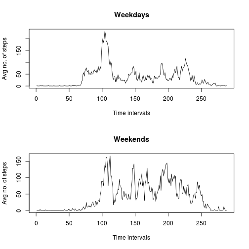

## Loading and preprocessing the data

```r
dataset <- read.csv("activity.csv")
```

It is convenient to split the dataset by day, transforming it in a matrix
whose rows contain the steps taken each day, and the column are the 5-min
intervals.

```r
no.days <- length(levels(dataset[1,2]))
no.obs.per.day <- length(dataset[which(dataset[,2] %in% day),][,1])
step.matrix <- matrix(dataset[,1], nrow=no.days, byrow=T)
```

## What is mean total number of steps taken per day?
Get the dates factor, get its levels, and for each day compute the total number of steps.

```r
steps <- c()
steps <- apply(step.matrix, 1, sum)
```

Plot the histogram.

```r
hist(na.omit(steps))
```

 

Compute mean and median.

```r
mean(steps, na.rm=T)
```

```
## [1] 10766.19
```

```r
median(steps, na.rm=T)
```

```
## [1] 10765
```


## What is the average daily activity pattern?

```r
steps.per.interval <- apply(step.matrix, 2, mean, na.rm = T)
plot(steps.per.interval, type='l')
```

 

Which 5-minute interval, on average across all the days in the dataset, contains the maximum number of steps?

```r
which.max(steps.per.interval)
```

```
## [1] 104
```


## Imputing missing values
How many `NA`s are there?

```r
length(which(is.na(step.matrix)))
```

```
## [1] 2304
```

Missing data is replaced with the average value in the corresponding time interval.

```r
for (col in 1:ncol(step.matrix)) {
        step.matrix[which(is.na(step.matrix[,col])),col] <- steps.per.interval[col]
}
steps <- apply(step.matrix, 1, sum)
```

Below, the histogram, and new mean and median values.

```r
hist(steps)
```

 

```r
mean(steps)
```

```
## [1] 10766.19
```

```r
median(steps)
```

```
## [1] 10766.19
```

`>` Do these values differ from the estimates from the first part of the assignment?

Having used the mean of each time interval in order to impute the data, the mean is the same,
while the median changes.

`>` What is the impact of imputing missing data on the estimates of the total daily number of steps?

The imputation strategy used has introduced bias in the distribution, making the most frequent case even more frequent.

## Are there differences in activity patterns between weekdays and weekends?

Separate data got of weekends from the data of weekdays.

```r
days <- as.Date(levels(dataset[,2]))
# italian settings, sorry
wds <- c('lunedì', 'martedì', 'mercoledì', 'giovedì', 'venerdì')
wd <- factor((weekdays(days) %in% wds)+1L,
             levels=1:2,
             labels=c('weekend', 'weekday'))
weekdays <- as.matrix(step.matrix[which(wd == 'weekday'),1], ncol=no.obs.per.day, byrow=T)
weekends <- as.matrix(dataset[which(wd == 'weekend'),1], ncol=no.obs.per.day, byrow=T)
```

Plot graphics.

```r
par(mfrow=c(2,1))
plot(apply(step.matrix[which(wd == 'weekday'),], 2, mean), type='l',
        main="Weekdays", xlab="Time intervals", ylab="Avg no. of steps")
plot(apply(step.matrix[which(wd == 'weekend'),], 2, mean), type='l',
        main="Weekends", xlab="Time intervals", ylab="Avg no. of steps")
```

 
